# Geldik Mi? 🚏

Toplu taşımada (Marmaray, metro, metrobüs, otobüs, vapur, tren, şehirlerarası
otobüs vb.) yolculuk yapan kişinin **ineceği durağı kaçırmamasını** sağlayan,
**dünyanın her yerinde kullanılabilen**, tarayıcıda çalışan ve telefonun ana
ekranına uygulama gibi eklenebilen (PWA — Progressive Web App) bir konum
alarmı uygulamasıdır. Arayüz **Türkçe ve İngilizce** olarak kullanılabilir.

**Hak Sahibi:** Onur Teryakioğlu — © 2026, tüm hakları saklıdır. Bkz. [LICENSE](LICENSE).

**🔴 Canlı demo:** [r0yc0ld.github.io/geldik-mi](https://r0yc0ld.github.io/geldik-mi/)

Aşağıdaki tüm ekran görüntüleri uygulamanın **çalışan, canlı sürümünden**
otomatik olarak alınmıştır (gerçek harita verisi, gerçek arama sonuçları) —
tasarım maketi değil, birebir göreceğin ekranlardır.

## Ekran görüntüleriyle adım adım tur

### 1 — Karşılama ve izinler

Uygulama açılır açılmaz ne olduğunu, neden izin istediğini ve kime ait
olduğunu net biçimde anlatır. Her izin ekranı önce **neden** gerektiğini
açıklar, ancak ondan sonra gerçek tarayıcı izin isteğini tetikleyen bir
düğme gösterir — hiçbir izin, açıklaması yapılmadan istenmez.

<table>
<tr>
<td width="33%">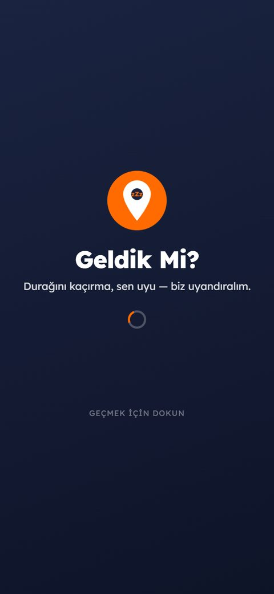<br><b>Açılış ekranı</b><br>Logo, isim, ve aşağıdan yukarı kayan jenerik: "Türkiye'de tasarlandı — Onur Teryakioğlu — Tüm hakları saklıdır". Sağ üstten her an atlanabilir.</td>
<td width="33%">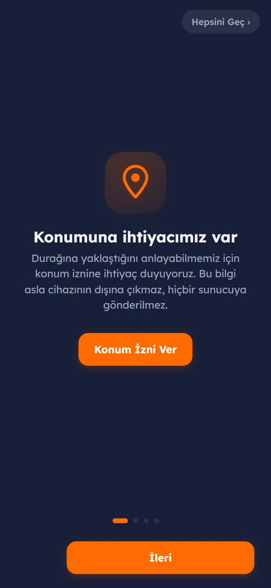<br><b>Neden konum?</b><br>Önce sade bir dille açıklama, sonra "Konum İzni Ver" düğmesi.</td>
<td width="33%">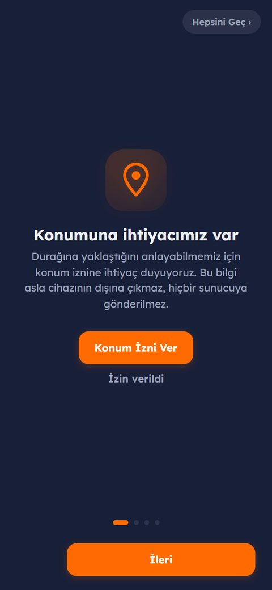<br><b>Anlık geri bildirim</b><br>İzin verilince ekranda hemen "İzin verildi" yazar.</td>
</tr>
<tr>
<td width="33%">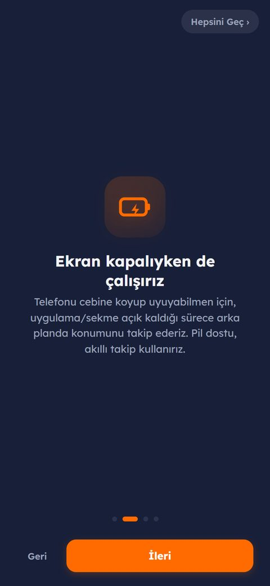<br><b>Pil dostu takip</b><br>Ekran kapalıyken de akıllı, pil tasarruflu takip yapıldığı anlatılır.</td>
<td width="33%">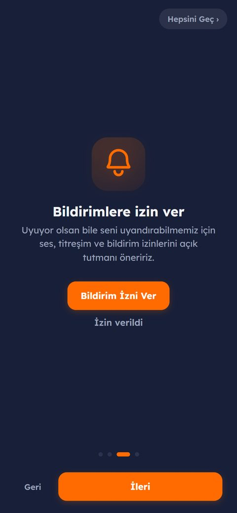<br><b>Bildirim izni</b><br>Uyurken bile uyandırabilmek için — yine önce açıklama, sonra izin düğmesi.</td>
<td width="33%">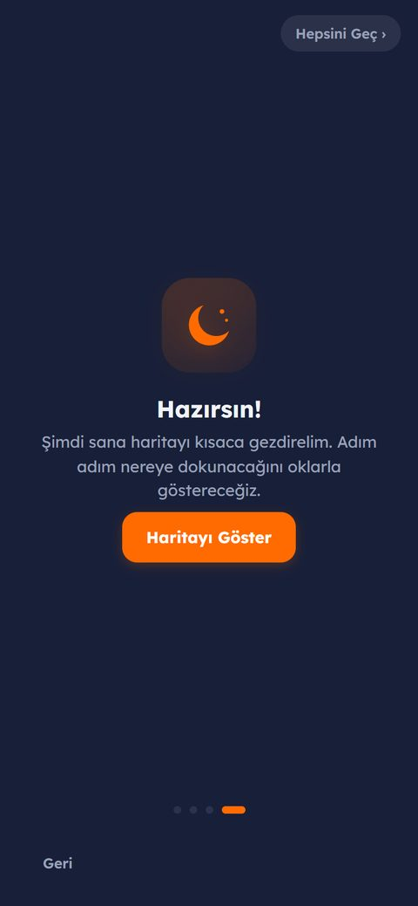<br><b>Hazırsın!</b><br>"Haritayı Göster" ile kısa, ok işaretli tanıtım turu başlar.</td>
</tr>
</table>

### 2 — Oklarla adım adım tanıtım turu

İlk harita açılışında, gerçekten nereye dokunacağını **canlı ok ikonları ve
parlayan bir çerçeveyle** gösteren kısa bir tur seni karşılar. Her adımda
"İleri" ile devam edilir; istenirse sağ üstten anında atlanabilir, sonradan
**Ayarlar → Kullanım turunu tekrar oynat** ile yeniden izlenebilir.

<table>
<tr>
<td width="33%">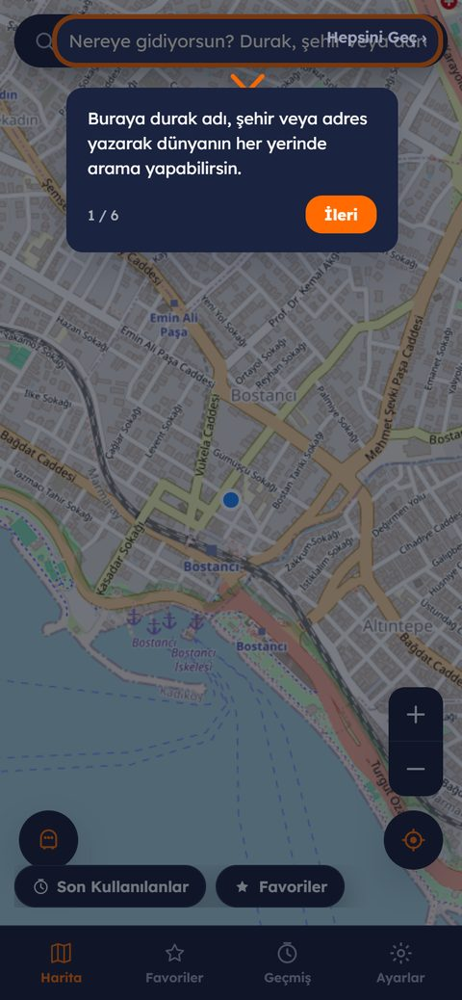<br><b>1/5 — Arama çubuğu</b><br>"Dünyanın her yerinde arama yapabilirsin."</td>
<td width="33%">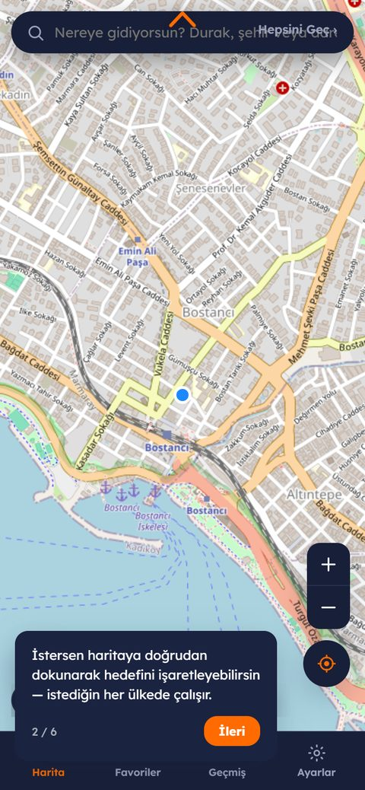<br><b>2/5 — Haritaya dokunma</b><br>Elle serbestçe hedef işaretleme anlatılır.</td>
<td width="33%">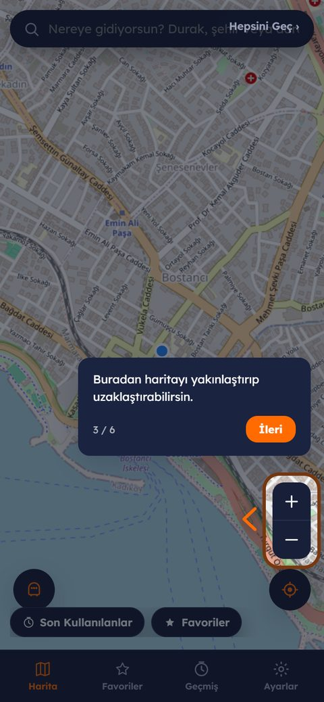<br><b>3/5 — Yakınlaştırma</b><br>Mobilde tek elle kolayca ulaşılan büyük + / − düğmeleri.</td>
</tr>
</table>

### 3 — Hazır konumlar: gerçek metro/tramvay hatların ve durakların

Konumuna izin verince (ya da "Konumuma git" deyince), sol alttaki hat
düğmesi o bölgedeki **gerçek** raylı sistem/tramvay hatlarını —
OpenStreetMap'in canlı verisinden, orijinal hat renkleriyle (M1 kırmızı,
M2 yeşil, M4 pembe gibi) — otomatik listeler. Bu, sadece İstanbul için
elle hazırlanmış sabit bir liste değil; **dünyanın herhangi bir yerinde**
(Ankara, İzmir, Eskişehir tramvayı, ya da başka bir ülkedeki bir şehir)
otomatik çalışır, çünkü veri kaynağı OpenStreetMap'in küresel, topluluk
tarafından güncellenen harita verisidir.

<table>
<tr>
<td width="50%">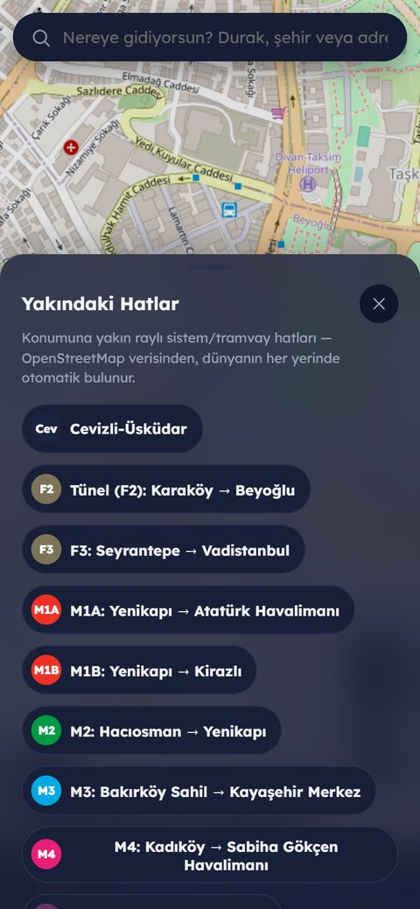<br><b>Hat listesi</b><br>Taksim yakınında bulunan gerçek hatlar: F2/F3 füniküler, M1A, M1B, M2, M3, M4… her biri kendi resmi rengiyle.</td>
<td width="50%">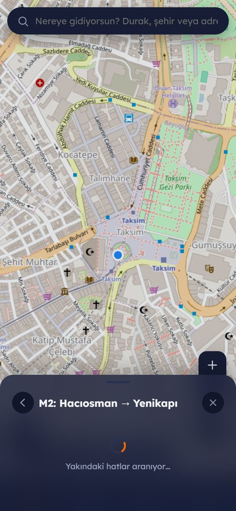<br><b>Durak listesi</b><br>Bir hatta dokununca o hattın tüm durakları sırayla listelenir; birine dokunmak yeter, hedef otomatik seçilir.</td>
</tr>
</table>

Bu tamamen **isteğe bağlı bir kısayoldur** — kullanmak zorunda değilsin,
istediğin zaman arama çubuğunu ya da haritaya dokunmayı kullanmaya devam
edebilirsin. Not: OpenStreetMap gönüllü emeğiyle güncellenen açık bir
veritabanıdır; bazı bölgelerde hat/durak verisi eksik ya da hatalı
etiketlenmiş olabilir (örn. bir servis hattı yanlışlıkla raylı sistem
olarak işaretlenmiş olabilir) — bu, kaynağın küresel ve ücretsiz olmasının
kaçınılmaz bir bedelidir.

### 4 — Hedefini seç: arayarak ya da elinle işaretleyerek

<table>
<tr>
<td width="33%">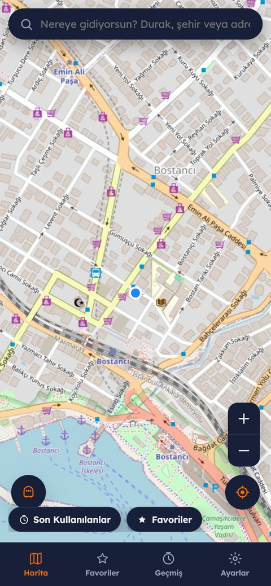<br><b>Konumuma git</b><br>Tek dokunuşla anında kendi konumuna uçarsın; mavi nokta seni gösterir.</td>
<td width="33%">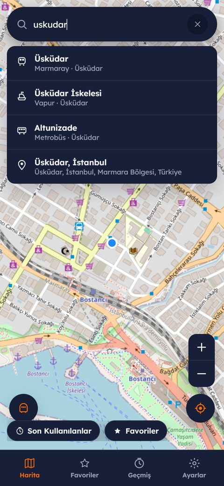<br><b>Akıllı arama</b><br>Yerel durak veritabanı (hat simgeleriyle) + dünya genelinde adres araması aynı anda listelenir. Türkçe karakter duyarsız: "uskudar" → Üsküdar.</td>
<td width="33%">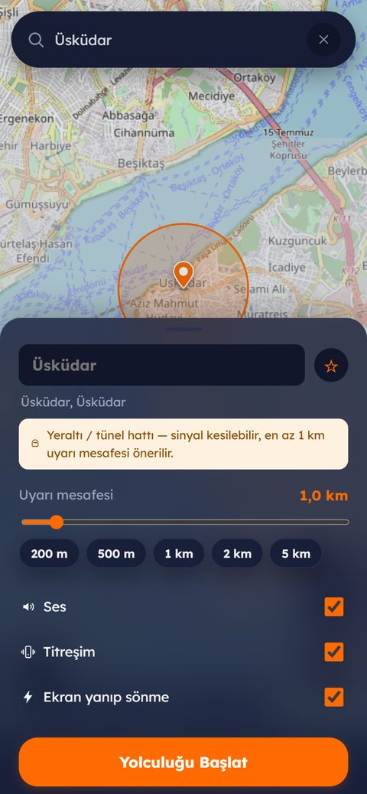<br><b>Hedef paneli</b><br>Yeraltı hattı seçilince otomatik uyarı: sinyal kesilebileceği için en az 1 km önerilir.</td>
</tr>
</table>

### 5 — Yarıçapı ayarla, yolculuğu başlat

<table>
<tr>
<td width="33%">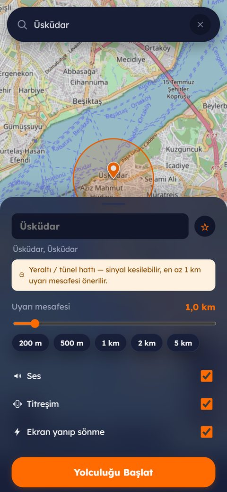<br><b>Canlı daire</b><br>Kaydırıcı ya da hazır seçenekler (200 m – 5 km); harita daireyi otomatik kadrajlar.</td>
<td width="33%">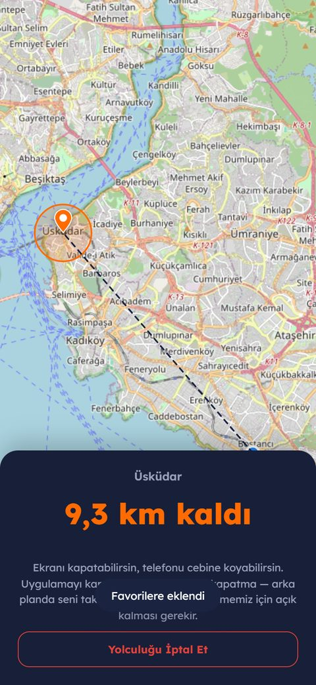<br><b>Aktif yolculuk</b><br>Kalan mesafe büyük puntolarla; ekranı kapatıp cebine koyabileceğin açıkça yazar.</td>
<td width="33%"><br><b>GELDİK! 🎉</b><br>Yanıp sönen ekran + artan alarm sesi + titreşim. Kaydırarak "Uyandım" de.</td>
</tr>
</table>

### 6 — Kendi kayıtlı/yıldızlı konumların, geçmişin, ayarların

<table>
<tr>
<td width="33%">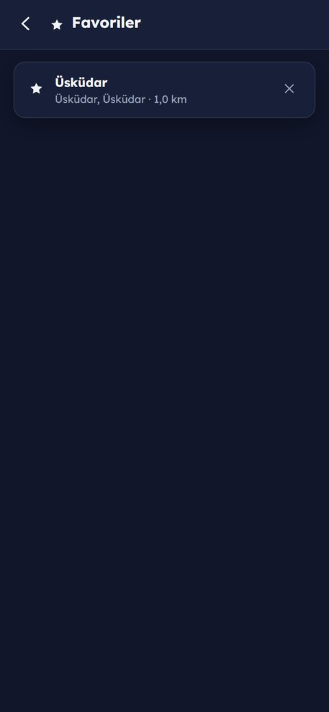<br><b>⭐ Favoriler</b><br>Bir hedefi yıldızlayınca burada birikir; tek dokunuşla tekrar seçilir.</td>
<td width="33%">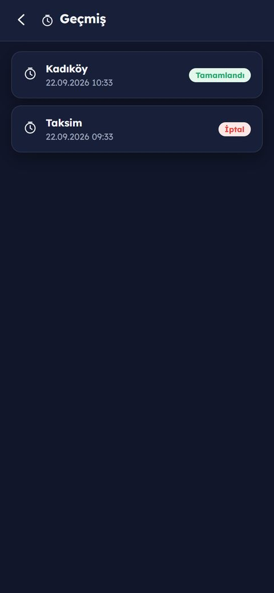<br><b>Geçmiş</b><br>Son 20 yolculuk, tamamlandı/iptal durumuyla birlikte.</td>
<td width="33%">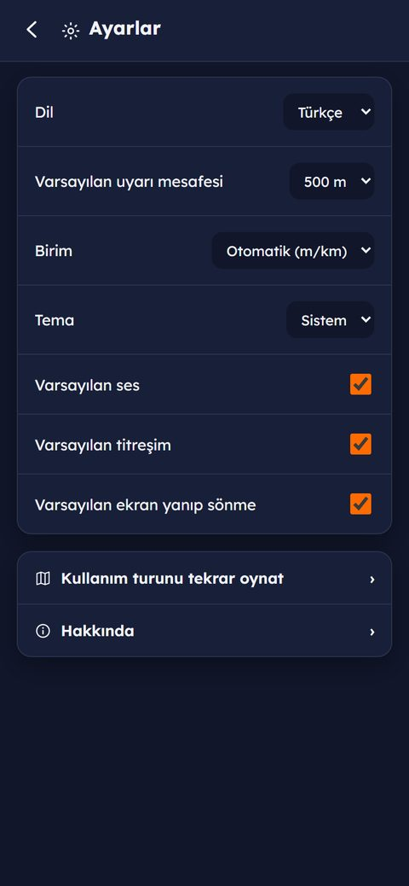<br><b>Ayarlar</b><br>Dil, birim, tema, varsayılan mesafe/ses/titreşim — hepsi tek yerde.</td>
</tr>
</table>

### 7 — Aynı uygulama, iki dilde ve iki temada

Tek bir kod tabanı; anlık dil ve tema değişimi, hiçbir sayfa yeniden
yüklenmeden gerçekleşir.

<table>
<tr>
<td width="33%">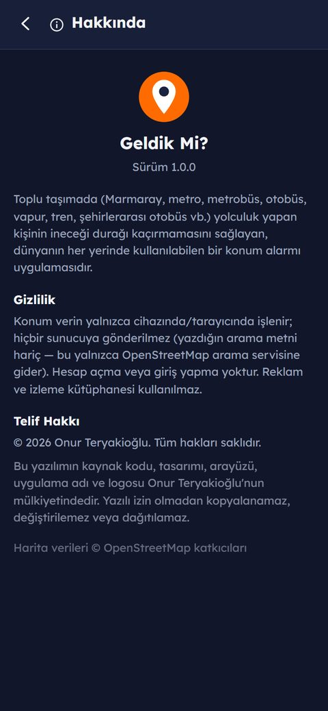<br><b>Hakkında</b><br>Hak sahibi, gizlilik ve telif bilgisi tek ekranda.</td>
<td width="33%">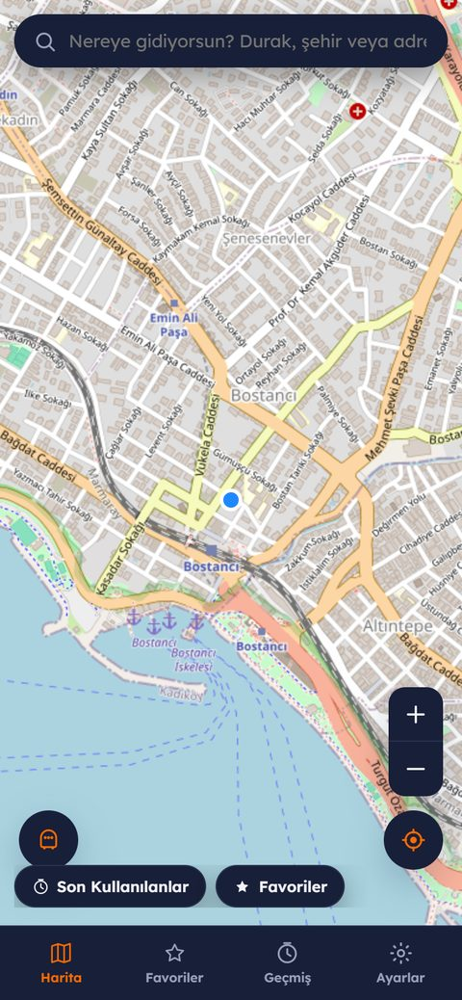<br><b>Koyu tema</b><br>Gece yolculukları için göz yormayan koyu arayüz.</td>
<td width="33%">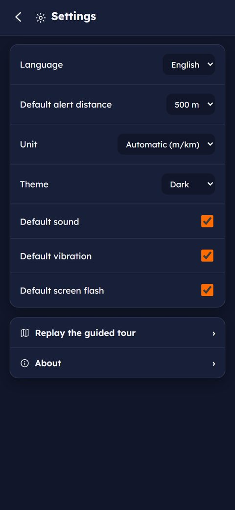<br><b>English UI</b><br>Ayarlar → Language → English; tüm arayüz anında çevrilir.</td>
</tr>
</table>

## Nasıl kullanılır? (özet akış)

1. **Uygulamayı aç.** Karşılama ve izin ekranlarını gör (yukarıdaki 1. bölüm),
   istersen sağ üstten **"Hepsini Geç"**.
2. **Kısa turu izle** ya da atla — nereye dokunacağını oklarla gösterir.
3. **Hedefini seç:** arama çubuğuna yaz **ya da** haritaya dokun/iğneyi sürükle.
4. **Uyarı mesafesini ayarla**, istersen ⭐ ile favorilere ekle.
5. **"Yolculuğu Başlat"** de, ekranı kapatıp telefonunu cebine koyabilirsin.
6. Hedefe yaklaşınca ekran yanıp söner, titrer, alarm çalar — kaydırarak
   **"Uyandım"** diyene kadar durmaz. Erken çalarsa "5 dk ertele" var.

## Öne çıkan özellikler

- **Global kullanım:** Harita ve arama dünyanın her yerinde çalışır (yalnızca
  İstanbul'a özel bir sınırlama yoktur); uygulama açık haritayla başlar ve
  konum iznin varsa otomatik olarak senin bulunduğun yere uçar.
- **Türkçe / İngilizce arayüz** — Ayarlar'dan dilini değiştirebilirsin.
- **Yakındaki hatlar (hazır konumlar):** Konumuna yakın metro/tramvay
  hatlarını gerçek adları ve resmi renkleriyle listeler (OpenStreetMap'ten,
  dünyanın her yerinde); bir hatta dokunup durağını hazır listeden de
  seçebilirsin — zorunlu değil, arama ve elle işaretleme her zaman açık.
- **Kendi kayıtlı/yıldızlı konumların** — bir hedefi ⭐ ile favorilere
  ekleyip tek dokunuşla tekrar seçebilirsin; tüm favoriler ve geçmiş
  yalnızca kendi tarayıcında saklanır.
- **Yeraltı/tünel çözümü:** Marmaray veya metro gibi yeraltı hatlarında GPS
  sinyali kesilebilir. Sinyal kesildiğinde uygulama son bilinen hızınla
  hedefe olan mesafeni **tahmin etmeye devam eder** ("tahmini" etiketiyle
  gösterilir) ve gerekirse bu tahmine göre alarmı yine de çalıştırır; sinyal
  geri geldiğinde de en yakın mesafenin yarıçapın altına inip inmediğini
  kontrol ederek "hedefi geçmiş olabilirsin" uyarısını tetikler. Yeraltı
  duraklarında varsayılan uyarı mesafesi otomatik olarak en az 1 km önerilir.
- **Daha görünür yakınlaştırma düğmeleri** — sağ altta, tek elle kolayca
  ulaşılabilecek büyüklükte özel tasarım + / − düğmeleri.
- **Özgün ikon ve logo seti** — hazır emoji yerine, uygulamaya özel çizilmiş
  bir SVG ikon takımı kullanılır (`icons/sprite.svg`).
- Kaydırarak onaylama, artan ses seviyesi, tekrarlanan bildirimler, koyu tema,
  akıllı (mesafeye göre uyarlanan) konum takibi.

## Yerel olarak çalıştırma

Herhangi bir kurulum/derleme adımı gerekmez — saf HTML/CSS/JS'dir. Servis
çalışanı (service worker) ve konum API'si `file://` üzerinden çalışmadığı
için basit bir yerel sunucuyla açman gerekir:

```bash
npx serve .
# veya
python -m http.server 8080
```

Sonra tarayıcında `http://localhost:8080` (veya `serve`'ün verdiği adresi) aç.

## Telefona "uygulama gibi" ekleme

Site HTTPS üzerinden (GitHub Pages) açıldığında:

- **Android / Chrome:** Menü (⋮) → "Ana ekrana ekle" / "Uygulama yükle".
- **iOS / Safari:** Paylaş simgesi → "Ana Ekrana Ekle".

Ekrana eklenen simgeye dokunduğunda site, adres çubuğu olmadan tam ekran bir
uygulama gibi açılır.

## Proje yapısı

```
geldik-mi/
├── index.html              tüm ekranlar (tek sayfa uygulama) + özgün ikon sprite'ı
├── css/style.css           tasarım sistemi (renkler, karanlık tema, animasyonlar)
├── js/i18n.js               Türkçe / İngilizce çeviri katmanı
├── js/app.js                uygulama mantığı (harita, alarm, favoriler, tahmini takip…)
├── js/stops-data.js         yerel durak veritabanı (İstanbul başlangıç seti)
├── manifest.webmanifest     PWA kurulum bildirimi
├── service-worker.js        çevrimdışı önbellekleme
├── icons/                   uygulama simgeleri + özgün SVG ikon seti
├── LICENSE                  tescilli yazılım lisansı
└── THIRD_PARTY_NOTICES.md   kullanılan açık kaynak bileşenler
```

## Teknoloji seçimleri ve bilinen kısıtlar

Bu uygulama bilinçli olarak **native bir mobil uygulama yerine, tarayıcıda
çalışan bir PWA** olarak geliştirildi (telefon ana ekranına eklenip
kurulum/mağaza olmadan, tek bir kod tabanıyla hem Android hem iOS'ta
kullanılabilmesi için). Harita altlığı olarak **OpenStreetMap + Leaflet**
kullanılır — Google Haritalar'ın aksine **API anahtarı ve faturalandırma
gerektirmez**, yollar, raylı hatlar ve feribot güzergâhları dahil ayrıntılı
harita verisini ücretsiz sağlar. Google Haritalar'a geçmek istenirse, bunun
için kendi Google Cloud API anahtarınızı ve faturalandırmanızı kurmanız
gerekir; harita katmanı ileride kolayca değiştirilebilecek şekilde
`ensureMap()` fonksiyonu arkasında tek bir yerde tutulmaktadır.

Web platformunun native Android/iOS'a göre bazı teknik sınırları vardır ve
bunlar dürüstçe belirtilmelidir:

- **Sekme/uygulama tamamen kapatılırsa** (görev geçmişinden kaydırılıp
  atılırsa) konum takibi durur — bu, tarayıcıların işletim sistemi seviyesi
  bir kısıtıdır, web sitesi bunu aşamaz. En güvenilir kullanım: uygulamayı
  ana ekrandan aç, yolculuk boyunca **kapatma**; ekranını kapatabilir ve
  telefonu cebine koyabilirsin — uygulama "Ekran Uyanık Tutma" (Wake Lock)
  API'siyle mümkün olduğunca ekranın kapanmasını geciktirmeye çalışır ve
  sekme öndeyken arka planda konum takibine devam eder.
- **Ekran parlaklığını maksimuma çıkarma** ve **kilit ekranının üstünde tam
  ekran açma** gibi native işletim sistemi seviyesindeki davranışlar web'den
  yapılamaz; bunun yerine sekme öndeyken tam ekran yanıp sönme + Web Audio
  alarm sesi + titreşim + (izin verildiyse) tekrarlanan bildirimler kullanılır.
- **Nominatim** (adres arama) istemci tarafından çağrılır; tarayıcı
  güvenliği nedeniyle özel bir `User-Agent` başlığı ayarlanamaz. İstekler
  istemci tarafında saniyede 1 ile sınırlanmıştır. Yoğun/ticari kullanımda
  kendi sunucunuz üzerinden vekil (proxy) kullanmanız önerilir.
- Yerel durak veritabanı (`js/stops-data.js`) İstanbul için bir başlangıç
  setidir, tüm istasyonları içermez; bazı koordinatlar `verified:false` ile
  işaretlenmiştir. Bunun dışında **arama ve haritaya dokunma dünyanın her
  yerinde çalışır** — durak veritabanı yalnızca hızlı seçim için bir ek katman.

## Gizlilik

Konum verin yalnızca cihazında/tarayıcında işlenir; arama sorguların dışında
hiçbir veri sunucuya gönderilmez. Hesap açma/giriş yoktur, reklam ve izleme
kütüphanesi kullanılmaz. Ayrıntılar için uygulama içi **Hakkında** ekranına
bakabilirsin.

## Lisans

Bkz. [LICENSE](LICENSE) ve [THIRD_PARTY_NOTICES.md](THIRD_PARTY_NOTICES.md).
